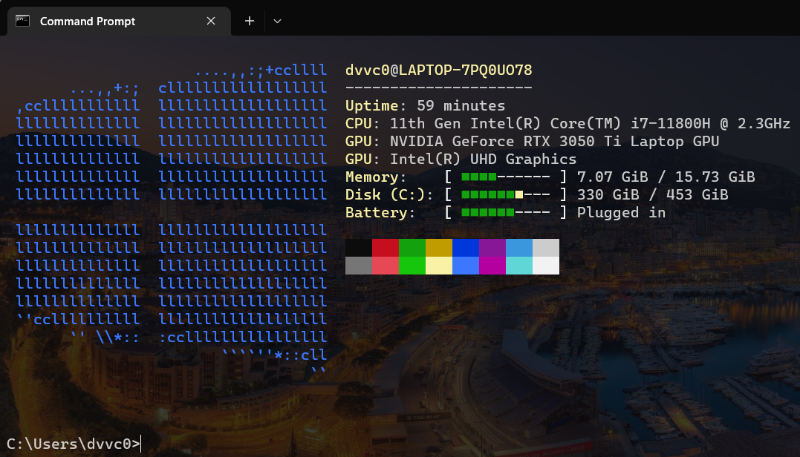

# Startup
This is my bash/powershell startup routine when creating a terminal.  

It's currently purely cosmetic but I wanted in on nice things that linux has like neofetch so I created this using [winfetch](https://github.com/kiedtl/winfetch) ([neofetch](https://github.com/dylanaraps/neofetch) for windows).

## Usage
1. Clone this repository, or download it as a folder
2. Set [src/start.cmd] to run when creating a terminal.
   1. Go into `regedit`
   2. Navigate to `HKEY_LOCAL_MACHINE\SOFTWARE\Microsoft\Command Processor`
   3. Create a string variable `AutoRun` with the value of the path of wherever you saved `src/start.cmd`
3. Open up a terminal and see for yourself
4. Note, to have winfetch look exactly as the preview, [you'll need to configure it yourself](https://github.com/lptstr/winfetch/wiki/Configuration).

